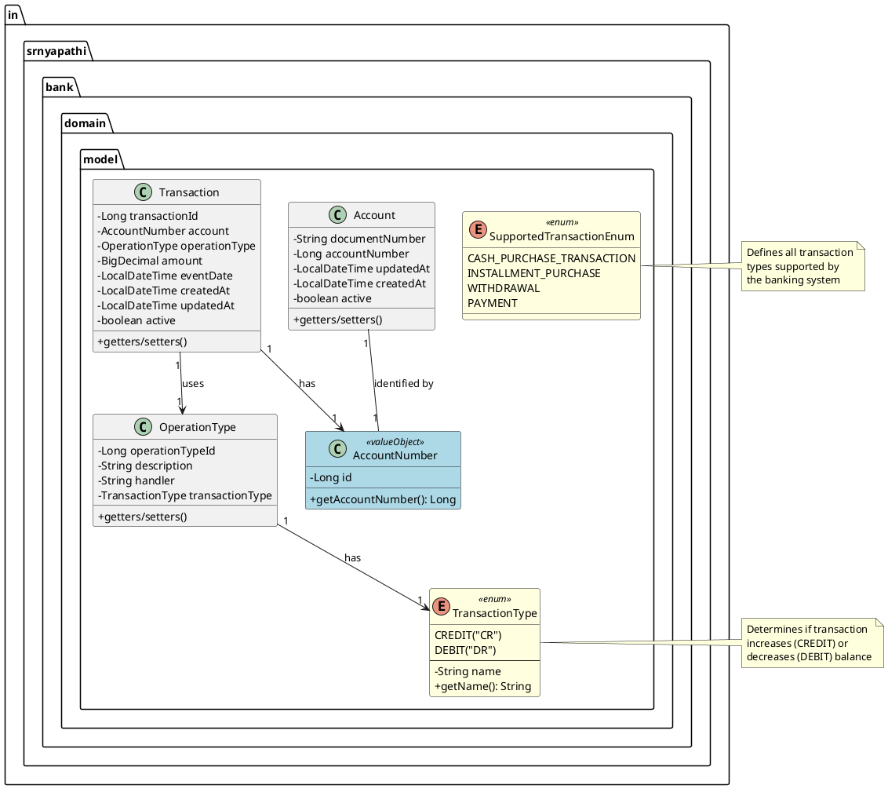
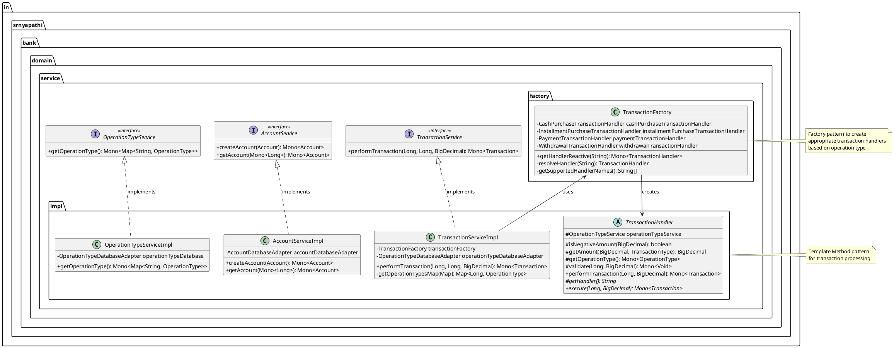
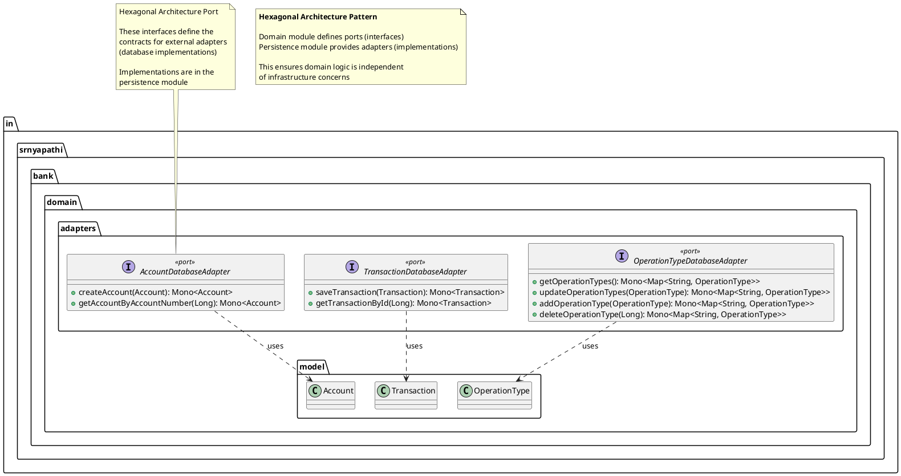
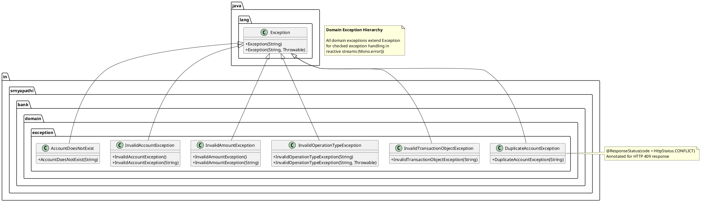
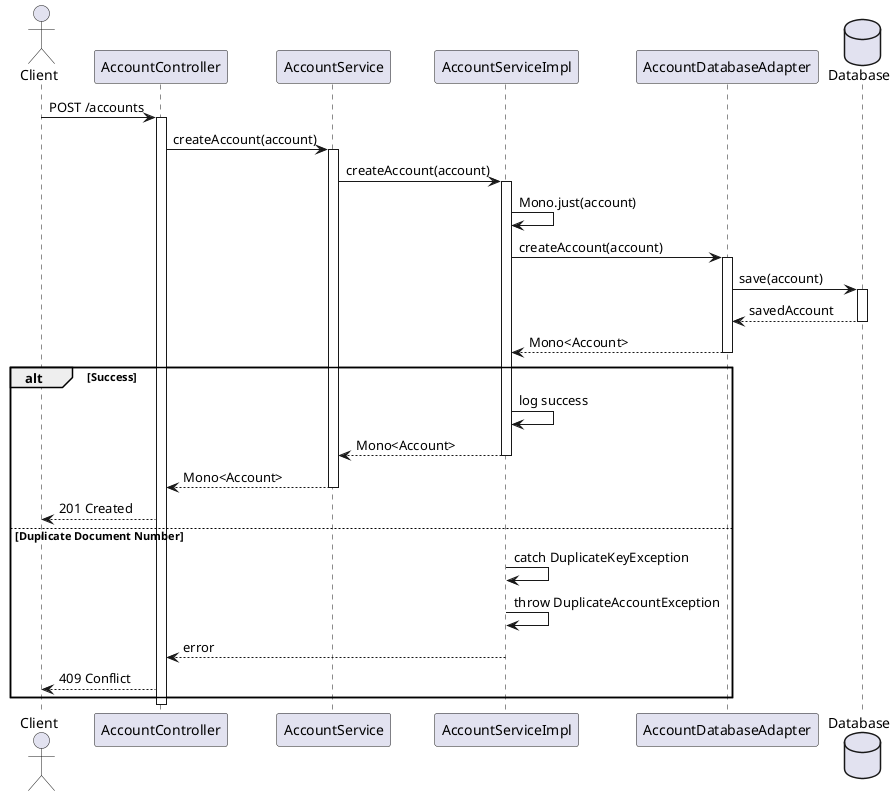
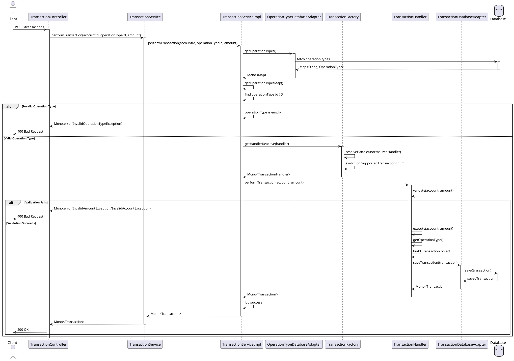
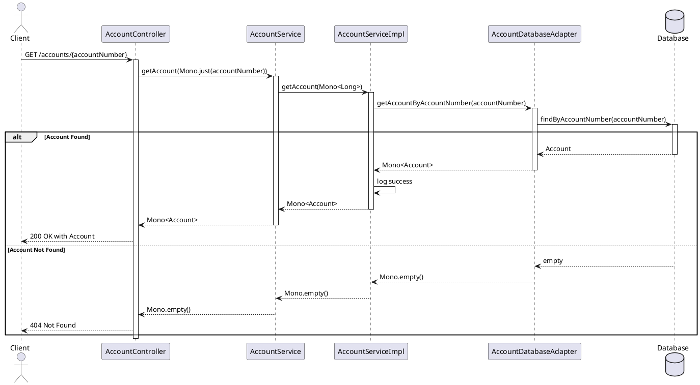

# Domain Module UML Diagrams

This document contains comprehensive UML diagrams for the Domain module of the Spring Reactive Bank Example application.

## Table of Contents
1. [Domain Model Class Diagram](#1-domain-model-class-diagram)
2. [Service Layer Class Diagram](#2-service-layer-class-diagram)
3. [Adapter Layer Class Diagram](#3-adapter-layer-class-diagram)
4. [Exception Hierarchy Diagram](#4-exception-hierarchy-diagram)
5. [Transaction Handler Hierarchy Diagram](#5-transaction-handler-hierarchy-diagram)
6. [Complete Domain Module Package Diagram](#6-complete-domain-module-package-diagram)
7. [Sequence Diagrams](#7-sequence-diagrams)

---

## 1. Domain Model Class Diagram

This diagram shows all the domain model classes and their relationships.

---

## 2. Service Layer Class Diagram

This diagram shows the service interfaces and their implementations.

---

## 3. Adapter Layer Class Diagram

This diagram shows the adapter interfaces that define ports for external dependencies.

---

## 4. Exception Hierarchy Diagram

This diagram shows all custom exceptions in the domain module.

---

## 5. Transaction Handler Hierarchy Diagram

This diagram shows the transaction handler hierarchy and the Strategy pattern implementation.

```plantuml
@startuml Transaction Handler Hierarchy

skinparam classAttributeIconSize 0

package "in.srnyapathi.bank.domain.service.impl" {
    
    abstract class TransactionHandler {
        # OperationTypeService operationTypeService
        --
        # {abstract} getHandler(): String
        # getOperationType(): Mono<OperationType>
        # isNegativeAmount(BigDecimal): boolean
        # getAmount(BigDecimal, TransactionType): BigDecimal
        # validate(Long, BigDecimal): Mono<Void>
        + performTransaction(Long, BigDecimal): Mono<Transaction>
        + {abstract} execute(Long, BigDecimal): Mono<Transaction>
    }
}

package "in.srnyapathi.bank.domain.service.handlers" {
    
    class CashPurchaseTransactionHandler {
        - TransactionDatabaseAdapter transactionDatabaseAdapter
        # getHandler(): String
        # validate(Long, BigDecimal): Mono<Void>
        + execute(Long, BigDecimal): Mono<Transaction>
    }
    
    class InstallmentPurchaseTransactionHandler {
        - TransactionDatabaseAdapter transactionDatabaseAdapter
        # getHandler(): String
        # validate(Long, BigDecimal): Mono<Void>
        + execute(Long, BigDecimal): Mono<Transaction>
    }
    
    class WithdrawalTransactionHandler {
        - TransactionDatabaseAdapter transactionDatabaseAdapter
        # getHandler(): String
        # validate(Long, BigDecimal): Mono<Void>
        + execute(Long, BigDecimal): Mono<Transaction>
    }
    
    class PaymentTransactionHandler {
        - TransactionDatabaseAdapter transactionDatabaseAdapter
        # getHandler(): String
        # validate(Long, BigDecimal): Mono<Void>
        + execute(Long, BigDecimal): Mono<Transaction>
    }
}

package "in.srnyapathi.bank.domain.service.factory" {
    class TransactionFactory {
        - CashPurchaseTransactionHandler cashPurchaseTransactionHandler
        - InstallmentPurchaseTransactionHandler installmentPurchaseTransactionHandler
        - PaymentTransactionHandler paymentTransactionHandler
        - WithdrawalTransactionHandler withdrawalTransactionHandler
        + getHandlerReactive(String): Mono<TransactionHandler>
        - resolveHandler(String): TransactionHandler
    }
}

' Inheritance
TransactionHandler <|-- CashPurchaseTransactionHandler
TransactionHandler <|-- InstallmentPurchaseTransactionHandler
TransactionHandler <|-- WithdrawalTransactionHandler
TransactionHandler <|-- PaymentTransactionHandler

' Dependencies
TransactionFactory ..> CashPurchaseTransactionHandler : creates
TransactionFactory ..> InstallmentPurchaseTransactionHandler : creates
TransactionFactory ..> WithdrawalTransactionHandler : creates
TransactionFactory ..> PaymentTransactionHandler : creates

note right of TransactionHandler
    **Template Method Pattern**
    
    performTransaction() is template method
    execute() is abstract step
    validate() can be overridden
end note

note bottom of TransactionFactory
    **Factory + Strategy Pattern**
    
    Factory creates appropriate handler
    based on SupportedTransactionEnum
    
    Each handler implements different
    business rules for its transaction type
end note

note left of CashPurchaseTransactionHandler
    Handler: "CASH_PURCHASE_TRANSACTION"
    Type: DEBIT
end note

note left of InstallmentPurchaseTransactionHandler
    Handler: "INSTALLMENT_PURCHASE"
    Type: DEBIT
end note

note left of WithdrawalTransactionHandler
    Handler: "WITHDRAWAL"
    Type: DEBIT
end note

note left of PaymentTransactionHandler
    Handler: "PAYMENT"
    Type: CREDIT
end note

@enduml
```

---

## 6. Complete Domain Module Package Diagram

This diagram shows the overall structure of the domain module with all packages and their relationships.

```plantuml
@startuml Complete Domain Module Structure

skinparam packageStyle rectangle
skinparam package {
    BackgroundColor<<model>> LightYellow
    BackgroundColor<<service>> LightGreen
    BackgroundColor<<adapter>> LightCyan
    BackgroundColor<<exception>> Pink
    BackgroundColor<<factory>> LightBlue
}

package "Domain Module" {
    
    package "model <<model>>" {
        class Account
        class Transaction
        class AccountNumber
        class OperationType
        enum TransactionType
        enum SupportedTransactionEnum
    }
    
    package "service <<service>>" {
        interface AccountService
        interface TransactionService
        interface OperationTypeService
    }
    
    package "service.impl" {
        class AccountServiceImpl
        class TransactionServiceImpl
        class OperationTypeServiceImpl
        abstract class TransactionHandler
    }
    
    package "service.handlers" {
        class CashPurchaseTransactionHandler
        class InstallmentPurchaseTransactionHandler
        class WithdrawalTransactionHandler
        class PaymentTransactionHandler
    }
    
    package "service.factory <<factory>>" {
        class TransactionFactory
    }
    
    package "adapters <<adapter>>" {
        interface AccountDatabaseAdapter
        interface TransactionDatabaseAdapter
        interface OperationTypeDatabaseAdapter
    }
    
    package "exception <<exception>>" {
        class InvalidTransactionObjectException
        class InvalidOperationTypeException
        class InvalidAmountException
        class InvalidAccountException
        class DuplicateAccountException
        class AccountDoesNotExist
    }
    
    package "config" {
        class DomainModuleConfiguration
    }
}

' Package dependencies
service --> model : uses
service.impl --> model : uses
service.impl --> service : implements
service.impl --> adapters : uses
service.impl --> exception : throws
service.handlers --> service.impl : extends
service.handlers --> adapters : uses
service.handlers --> model : uses
service.handlers --> exception : throws
service.factory --> service.handlers : creates
service.factory --> service.impl : returns

note right of model
    **Core Domain Entities**
    - Account
    - Transaction
    - OperationType
    - Enumerations
end note

note right of adapters
    **Hexagonal Architecture Ports**
    
    Interfaces for external dependencies
    Implemented in persistence module
end note

note right of service
    **Domain Services**
    
    Business logic and orchestration
    Reactive operations (Mono/Flux)
end note

note right of exception
    **Domain Exceptions**
    
    Business rule violations
    Validation errors
end note

@enduml
```

---

## 7. Sequence Diagrams

### 7.1 Create Account Sequence Diagram

### 7.2 Perform Transaction Sequence Diagram

### 7.3 Get Account Sequence Diagram

---

## Design Patterns Used in Domain Module

### 1. **Hexagonal Architecture (Ports and Adapters)**
- **Ports**: `AccountDatabaseAdapter`, `TransactionDatabaseAdapter`, `OperationTypeDatabaseAdapter`
- **Core Domain**: Service implementations
- **Adapters**: Implemented in persistence module

### 2. **Strategy Pattern**
- **Context**: `TransactionServiceImpl`
- **Strategy Interface**: `TransactionHandler`
- **Concrete Strategies**: `CashPurchaseTransactionHandler`, `InstallmentPurchaseTransactionHandler`, `WithdrawalTransactionHandler`, `PaymentTransactionHandler`

### 3. **Factory Pattern**
- **Factory**: `TransactionFactory`
- **Products**: Different `TransactionHandler` implementations
- **Creation Logic**: Based on `SupportedTransactionEnum`

### 4. **Template Method Pattern**
- **Abstract Class**: `TransactionHandler`
- **Template Method**: `performTransaction()`
- **Abstract Methods**: `execute()`, `getHandler()`
- **Hook Methods**: `validate()` (can be overridden)

### 5. **Value Object Pattern**
- **Value Objects**: `AccountNumber`
- **Characteristics**: Immutable, compared by value

### 6. **Repository Pattern** (through adapters)
- **Interfaces**: Database adapter interfaces
- **Encapsulation**: Database access logic

---

## Module Responsibilities

### Model Package
- Define core domain entities
- Represent business concepts
- Maintain invariants

### Service Package
- Define business operations
- Orchestrate domain logic
- Provide reactive APIs

### Adapter Package
- Define ports for external systems
- Decouple domain from infrastructure
- Enable testability

### Exception Package
- Express business rule violations
- Provide meaningful error messages
- Support error handling in reactive streams

### Factory Package
- Create complex objects
- Encapsulate creation logic
- Support extensibility

---

## Reactive Programming with Project Reactor

All service methods return:
- `Mono<T>` - Single value or empty
- `Flux<T>` - Multiple values (not used in current implementation)

Benefits:
- Non-blocking I/O
- Backpressure support
- Composable operations
- Error handling in streams

---

## Key Architectural Principles

1. **Separation of Concerns**: Each package has a clear responsibility
2. **Dependency Inversion**: Domain depends on abstractions (adapters), not implementations
3. **Open/Closed Principle**: New transaction types can be added without modifying existing code
4. **Single Responsibility**: Each handler focuses on one transaction type
5. **Interface Segregation**: Small, focused interfaces

---

Generated: December 26, 2025
Module: Domain Module
Project: Spring Reactive Bank Example

